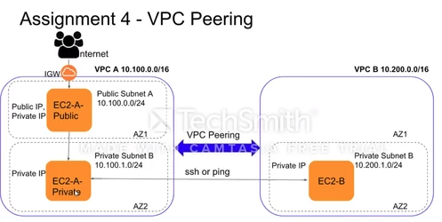

# VPC Peering

#### What is VPC Peering?
서로 다른 VPC 간에 IP Traffic을 서로 왕래할 수 있도록 해주는 기술이다. 이를 사용하면 서로 다른 VPC에 있는 Instance 간에 통신이 가능해 진다.

#### When is it useful?
어떤 A, B 두 개의 EC2가 있다고 하자.
* A: Database가 있음. VPC 1에 소속. Elastic IP 없음.
* B: Crontab이 돌아가는 서버. 어떤 작업이 돌아갈 때 마다 Cache에서 데이터를 불러와서 사용한다. VPC 2에 소속. Elastic IP 없음.

이 상태에서 A가 DB에 있는 정보를 추출해서 다른 서버들에 Caching을 해주고 싶은데, B로 갈 길이 없다. 이때 서로 다른 VPC에 있는 Server들을 연결하고 싶다면 VPC Peering 기술을 사용하면 된다.

#### How to use?
0. 사전 조건: 1개 Region에 2개의 VPC가 있다고 가정하겠다. 각 VPC의 Subnet에 Instance가 하나씩 있다고 가정하자.
  * A VPC 내 Server 1는 Subnet X에 속해 있다.: A-1 @ Subnet X
  * B VPC 내 Server 2는 Subnet Z에 속해 있다.: B-2 @ Subnet Z
1. VPC Peering 생성
  * AWS Console - VPC - Peering connection을 선택한다.
  * Create Peering Connection 이라는 파란 버튼 클릭
  * 아래 정보 기입
    * Name tag 기입
    * 연결할 두 개의 VPC를 선택
    * Create peering connection 이라는 파란 버튼 클릭
  * 생성된 Peering 정보를 확인해야 한다. 확인 후 OK
  * 방금 생성한 Peering 정보가 나온다. Status가 "Pending Acceptance"라고 나와 있는데, 사용자가 직접 Accept 해야 Peering이 완료된다.
    * 
    * 해당 Row 선택해서, Action의 "Accept request"를 클릭한다.
    * 다이얼로그 박스로 Accept 여부를 물어본다. Accept 클릭
    * Peering이 Established 되었다는 다이얼로그가 나온다. OK 클릭
  * 본 작업으로 Peering은 완료가 되었다. 하지만, 두 Server 간의 통신이 가능해지려면 Route table까지 수정해 주어야 한다.
2. Route table 수정
  * Peering 완료 후 연결할 두 Server가 속해 있는 Subnet의 Route table을 수정해 주어야 한다.
  * VPC - Route table에 들어간다.
    * A Server의 VPC의 X Route table 정보를 확인한다.
    * Edit를 누르고, Another route를 추가하는데
      * Destination: 상대방 Subnt의 IPv4 CIDR
      * Target: 위에서 만든 Peering 객체를 선택한다.
    * Save
  * 위 작업을 B Server 입장에서도 똑같이 해준다.
3. Security group 수정
  * Security Group 까지 수정해 준다. 이 부분은 Security group 내용 참고.
    * 간단하게, 서로의 CIDR과 Port, 용도를 기재해 주어 Inbound 만 열어주면 된다.
4. Test
  * PING 설정 1
    * A, B Server의 Security group에 ALL ICMP 형태로 Inbound를 추가하는데, 서로의 Subnet CIDR을 입력한다.
    * 그리고 A, B 서버 각각 들어가서 Test 해보면...
    ```bash
    $ ping {ip of the server A}
    PING {ip of the server A} 56(84) bytes of data.
    64 bytes from {ip of the server A}: icmp_seq=1 ttl=64 time=0.139 ms
    64 bytes from {ip of the server A}: icmp_seq=2 ttl=64 time=0.108 ms
    ...
    # B Server 에서도 동일한 동작 결과를 얻을 수 있다.
    ```
  * PING 설정 2
    * 위에서 설정한 것과 동일한데, 이번에는 Security group에 서로의 Subnet CIDR이 아니라 서로의 Security group을 넣고 진행해 본다.
    * 위 사례와 동일한 결과를 나타낸다.
  * 위에서 보았듯이 서로 연결이 잘 되었다면, 필요한 Port만 열어서 서로 연결하게 해 준다. Redis간, Postgresql 이건...

#### Reference
* https://docs.aws.amazon.com/vpc/latest/userguide/vpc-peering.html
* https://docs.aws.amazon.com/vpc/latest/peering/what-is-vpc-peering.html
* https://youtu.be/HMInA8yMw1k
  * 
