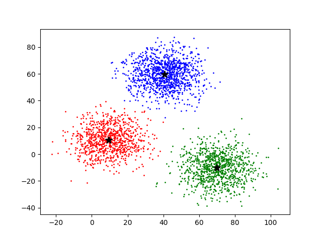
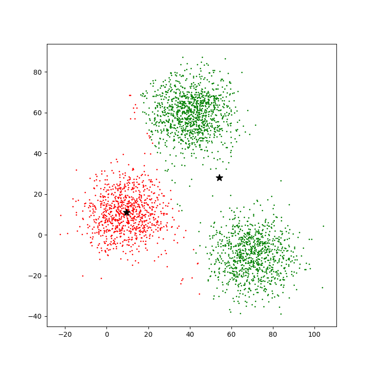
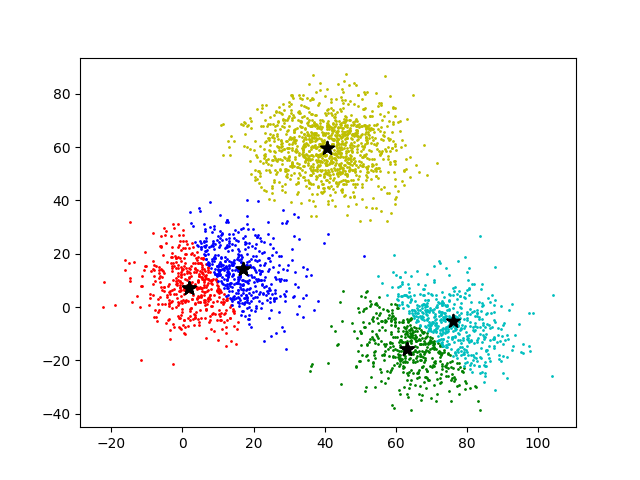
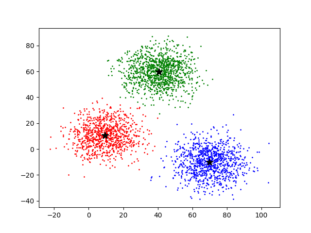

# K-means

# Definition
* 주어진 데이터를 정해진 개수의 클러스터로 묶는 알고리즘.
* 분리형 군집화 알고리즘. 각 클러스터와 거리 차이의 분산을 최소화 하는 방법으로 진행

#### Details
* 각 군집은 하나의 중심, Centroid를 가진다.
* 사용자가 처음에 몇 개의 군집으로 구성할 지, 군집 개수, k를 지정해야 한다.
  * k가 hyperparameter이다.
    * hyperparameter: 파라미터가 매개변수가 된다는 의미, 초매개변수 라고도 불린다.
    * https://ikkison.tistory.com/92
* EM 알고리즘을 기반으로 동작, E와 M 과정을 특정 조건이 만족할 때까지 반복하는 것.
  * Expectation, Maximization
* 계산의 복잡성은 O(n)

#### Pros Cons
* 중심 초기값을 어떻게 넣어 주느냐에 따라서 결과가 크게 바뀜
  * Cluster가 실제로는 3개인데 k를 2나 10으로 넣거나...
  * 초기 위치를 어디에 넣느냐에 따라서 달라지거나...
  * Cluster 간 밀도가 다를때도 달라진다.
  * Cluster가 특이한 형태로 군집되어 있을 때도 결과가 특이하게 나온다. 이를테면 원형.

#### Category
* Unsupervised learning
* Data driven( Clustering )

#### Example
* 여기서는 1 Row에 2개의 데이터를 가지고 테스트 해본다. 실제로는 1개 Row에 N개가 있을 수 있다.
```python
from argparse import ArgumentParser
import numpy as np
import matplotlib.pyplot as plt
import copy

def distance( data, c ):

  n = len( data )
  k = len( c )
  D = np.zeros( [ k, n ] )
  p = len( data[ 0 ] )

  # Center와 Data 간의 거리를 측정한다. 여기서는 데이터가 2x1 이지만, Nx1 이 될 수도 있다.
  for i in range( k ):
    for j in range( n ):
      D[ i, j ] = np.sqrt( sum(
          ( c[ i, indx ] - data[ j, indx ] ) ** 2 for indx in range( 0, p, 1 )
    ) )
  return D


if __name__ == '__main__':

    prsr = ArgumentParser()
    prsr.add_argument( '-v', '--verbose', action = 'store_true' )
    args = prsr.parse_args()

    verb = args.verbose

    # Load dataset
    with open( 'xy.csv', 'r' ) as f:
        srcs = list( map( lambda x: x.strip().split( ',' ), f.readlines()[ 1: ] ) )
    data = np.array( [ list( map( float, x ) ) for x in srcs ] )

    # Set center. 3 centroid are setup in here.
    c = np.array( [
        [ 1.0, 1 ],
        [ 2, 1 ],
        [ 3, 1 ]
    ] )

    # Iteration until mean is 0
    eq = 0
    iter = 1
    while eq != 1:
        c_old = copy.deepcopy( c )
        D = distance( data, c )  # Distance 계산
        G = np.argmin( D, 0 )  # Group 계산
        k = len( c )
        for i in range( k ):
            datai = np.array( [data[ j ] for j in range( len( data ) ) if G[ j ] == i ] )
            c[ i ] = np.mean( datai, 0 )  # Center 계산
        eq = np.mean( np.equal( c, c_old ) )
        iter += 1
        if verb:
            print( 'Iteration: {} | {} | {}'.format( *map( str, ( iter, c, c_old ) ) ) )

    # Plotting
    colors = [ 'r', 'g', 'b', 'y', 'c', 'm', 'purple', 'gray', 'pink' ]
    k = len( c )
    for i in range( k ):
        datai = np.array( [data[ j ] for j in range( len( data ) ) if G[ j ] == i ] )
        plt.scatter( datai[ :, 0 ], datai[ :, 1 ], c = colors[ i ], s = 1 )
        plt.scatter( c[ :, 0 ], c[ :, 1 ], marker = '*', c = 'black', s = 100 )
```


* 여기서 Center를 2개만 잡아보면...( [ 2, 1 ] 제거 )  


* Center를 5개로 늘리면...( [ 5, 1 ], [ 7, 1 ] 추가 )  


* Center는 3개인데 이상한 위치를 잡으면? ( [ 1, 1 ], [ 5, 1 ], [ 100, 1 ] )  


#### Reference
* https://ko.wikipedia.org/wiki/K-%ED%8F%89%EA%B7%A0_%EC%95%8C%EA%B3%A0%EB%A6%AC%EC%A6%98
* https://ratsgo.github.io/machine%20learning/2017/04/19/KC/
* https://eunsukimme.github.io/ml/2019/12/16/K-Means/
