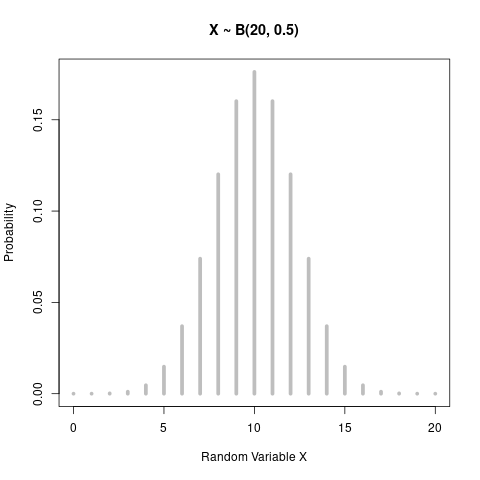
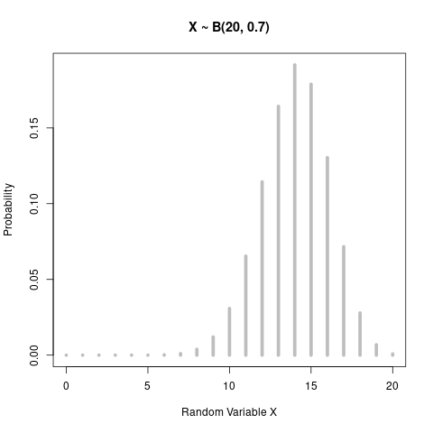
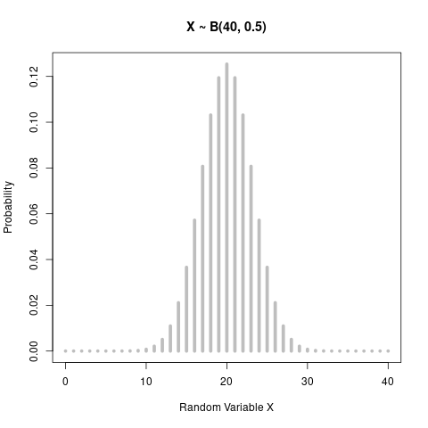

# Binomial distribution, 이항 분포

#### Definition
* 베르누이 시행을 n번 수행한 이후, 성공이 나온 횟수를 X라 하자.
  * 오락실 농구 게임에서 10번 던지는데, 골을 넣은 횟수 ==> X
  * 판치기 할 때 동전 넘어가는 횟수 ==> X
* 여기서 X를 이항 확률 변수, **Binomial Random Variable** 이라고 한다.
* 여기서 중요한 점은, n번의 수행중에 이전 결과가 다음 결과에 전혀 영향을 미치지 않는 **독립 사건**이라는 점이다.
  * 보통 바구니 예제를 많이 보았을텐데, 복원 추출이 이 경우가 된다. 하나 뽑아도, 다시 이걸 주머니에 넣으면, 매번 어떤 아이템을 뽑을 확률은 변하지 않는다.
* 즉, 베르누이 시행을 n번 수행한 결과로 나오는 확률 분포를 **Binomial distribution**라고 한다.

#### Equation
$f(x)=nCx*p^x*q^{(n-x)}$
* if x = 0, 1, 2, ..., n and q = 1 - p

#### Expectation and Variance
* $E(X)=np$
* $V(X)=npq$

#### Plot
```R
a <- dbinom( 0:20, size = 20, prob = 0.5 )
b <- dbinom( 0:20, size = 20, prob = 0.7 )
c <- dbinom( 0:40, size = 40, prob = 0.5 )

plot( 0:20, a, type='h', lwd=5, col="grey", ylab="Probability", xlab="Random Variable X", main = c("X ~ B(20, 0.5)"))
plot( 0:20, b, type='h', lwd=5, col="grey", ylab="Probability", xlab="Random Variable X", main = c("X ~ B(20, 0.7)"))
plot( 0:40, c, type='h', lwd=5, col="grey", ylab="Probability", xlab="Random Variable X", main = c("X ~ B(40, 0.5)"))
```




#### Reference
* https://m.blog.naver.com/mykepzzang/220838887115
